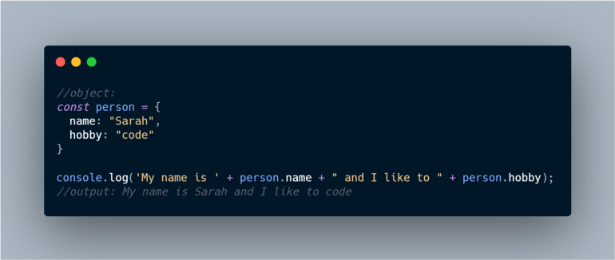

What is object destructuring? Object destructuring is used to extract the property values of an object and assign them to variables.

Similar to Array destructure, object destructure shares a similar syntax. You just have to replace the square bracket with the curly bracket. (If you haven’t read my previous blog on array destructure, I’d recommend you to read that first). Here, I’ll cover most of the things that you need to know about object destructuring.

You might already know that to access any property value of an object, the basic syntax is:

<pre>
    <code>
        objectname.propertyname
    </code>
</pre>

### Extracting property values of an object before destructure:

Now this way is going to get extremely annoying when you’ll have to access the values multiple times or when you will be dealing with nested objects.
